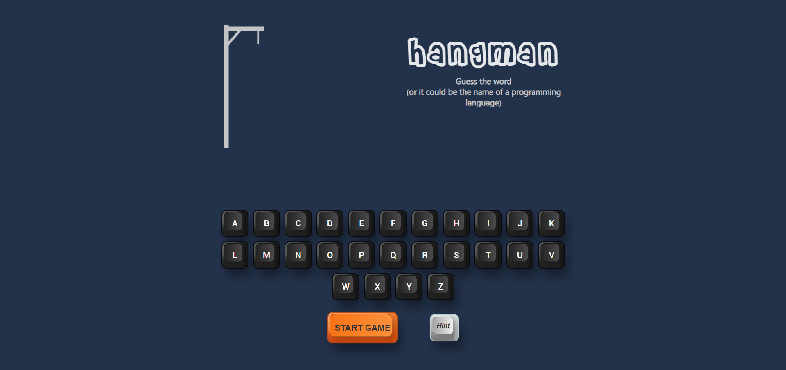
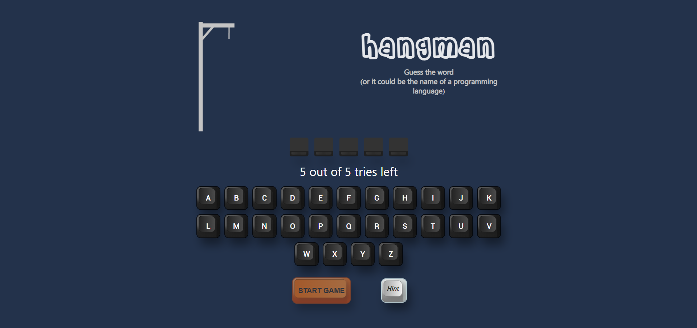
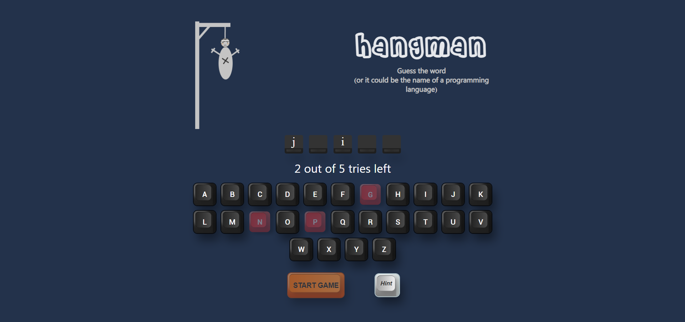
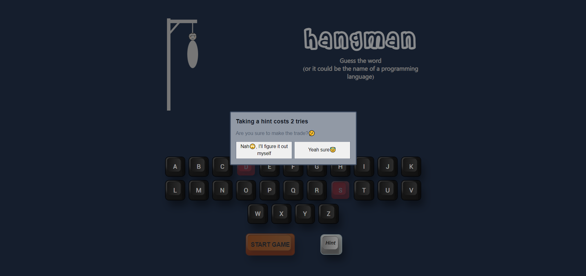
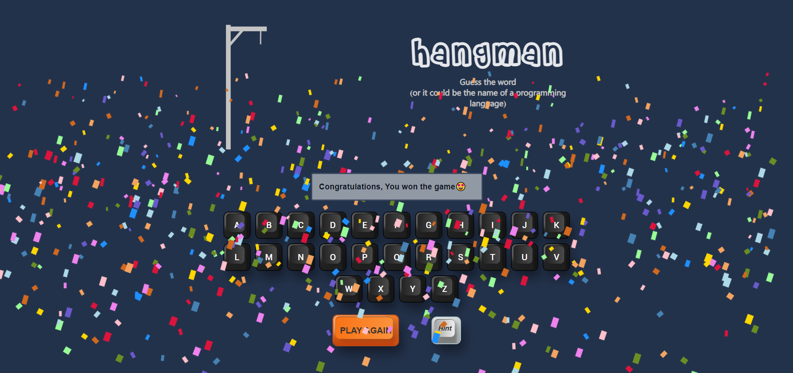
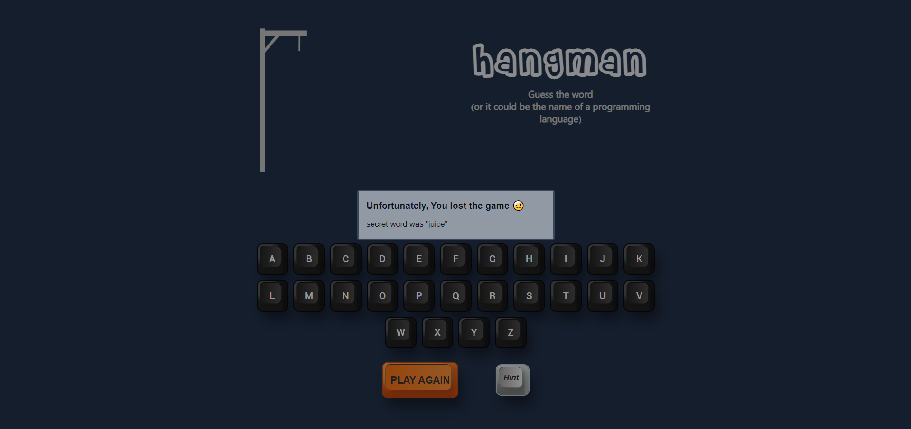

# hangman game

### Check it out [here](https://tangerine-elf-3fca3b.netlify.app/)

---

### Playing the game

> You open it and the interface looks like this

> You click start game and the game starts

> now you start guessing the word by clicking on alphabets

> Alphabets that are not in the word, turn red by clicking on them. And the completion of hangman starts

> Good New, You can get hints. Bad news, you get that at a cost. As shown below. It first asks you

> If you agree, then it fills random empty block

> Interface when you win

> When you lose. (It also shows the word)

#### So this is how its played. Hope you liked it
